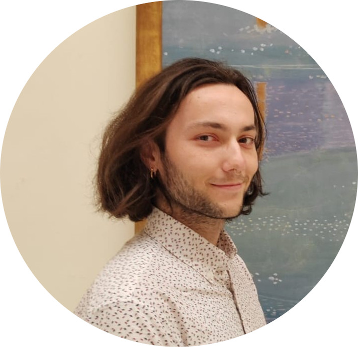

# NLP Student  
Technical Skills: Python, Bash, XML, HTML5/CSS, C++  

## Education  
- M.D., NLP | Institut National des Langues et Civilisations Orientales (December 2024)
- B.S., Mandarin and NLP | Institut National des Langues et Civilisations Orientales (June 2023)
- B.S., Chinese Medecine | Nanjing University of Chinese Medecine (June 2019, unfinished due to COVID-19 pandemic)  

## Work Experience  
**Internship @ Sikana (Summer 2023)**  
- Updating and chaptering of the Sikana video library. Video editing and voice-over.  

**Expert in Chinese linguistics @ Open Bee (Summer 2021)**  
- Traditional and simplified Chinese OCR expertise.

